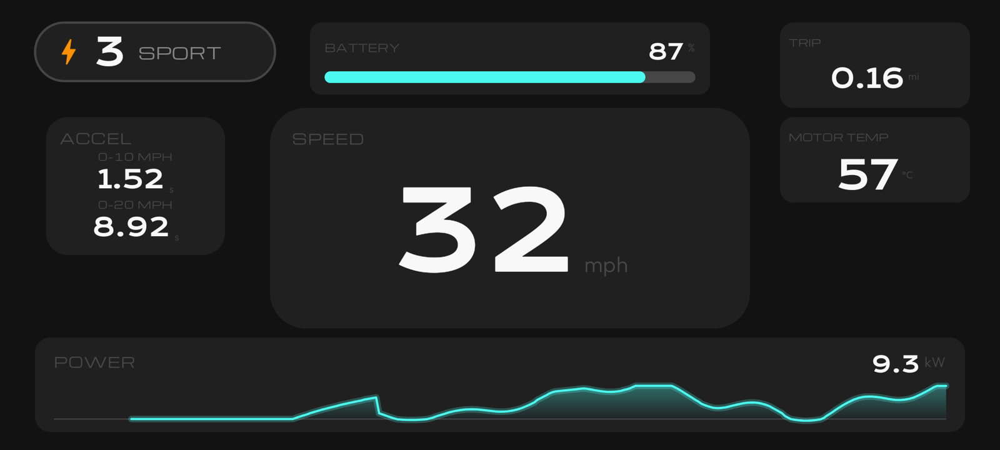
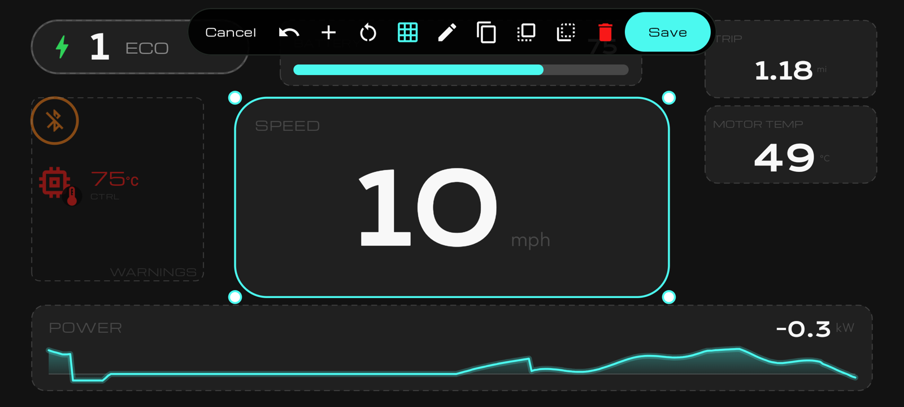
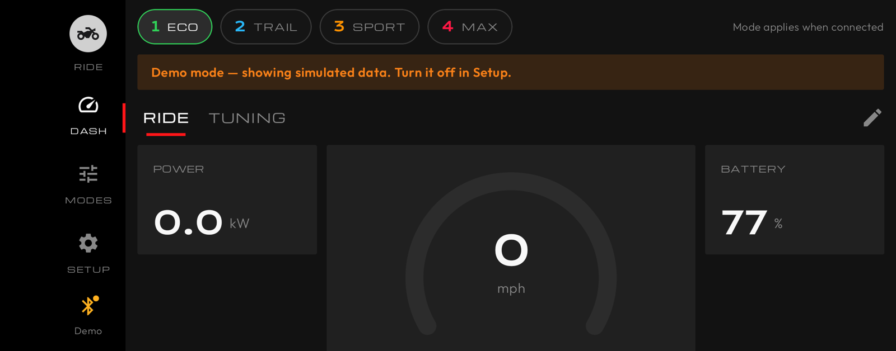
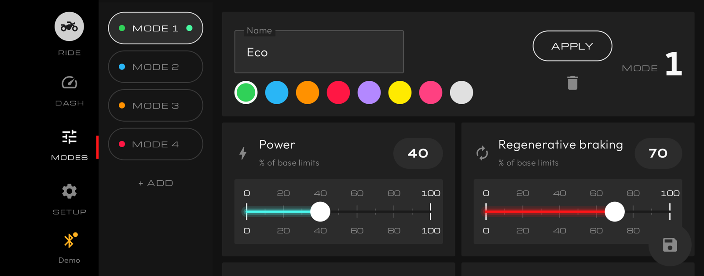
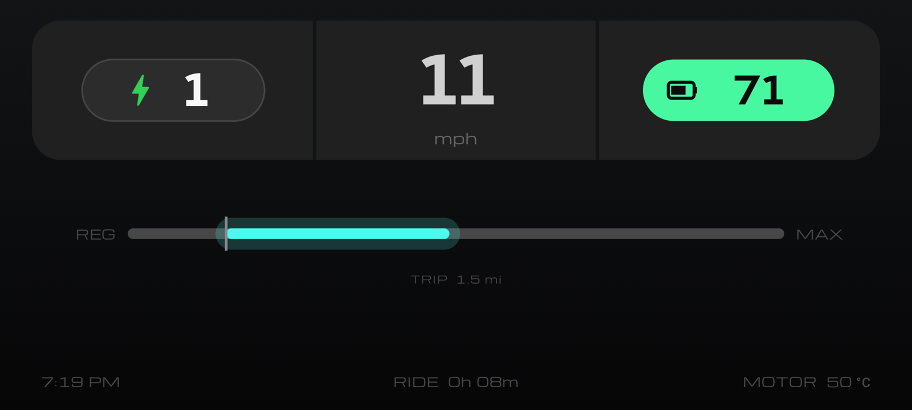

# VESC Dash

An Android app that connects to a VESC motor controller over Bluetooth: a live dashboard, a full-screen ride view and per-mode power tuning.

| | |
|---|---|
| <br>Custom ride screen with an accel timer | <br>Drag-and-resize layout editor |
| <br>Dashboard | <br>Power tuner |
| <br>Tiles ride style | |

## Features

- **Live dashboard.** Swipeable pages of number, gauge, bar and graph widgets, each showing any metric with its own scale and warning colors.
- **Drive modes.** Up to 6, one tap to switch. Sliders set power % (down to 1 %), regen %, top speed and power cap, with an estimated peak kW and a power-vs-speed curve. With throttle control on, an editable throttle-curve graph and a power build-up slider (instant to slow) sit under Power. **Show advanced** adds battery and regen-charge current, max duty, a regen power cap and the release ramp.
- **Ride view.** Full-screen landscape display in four styles (Classic gauge, Minimal, Tiles, Custom), dark, light or auto. Tap the ⚡ pill to change mode; when you're stopped a home button returns to the app.
- **Custom ride screen.** Place dashboard widgets anywhere, sized to fit, next to the mode pill and warning icons. Tap the pencil beside the home button (or Setup → Ride view → Edit custom layout): drag to move, pinch or drag a corner to resize, with snapping, undo and reset.
- **Accel timer.** A Custom-screen widget that times a standing start to the speeds you set (e.g. `30, 60`, in your units). Tap it while stopped, then go: timing starts as you pass 1 mph/km/h and the result stays until you tap again. Times are interpolated between readings, so they're only as accurate as your wheel, pole and gearing settings; a Bluetooth dropout ends the run, and results are forgotten when the app restarts.
- **Two appearances.** Classic, or Stark Varg: an unofficial, landscape-only lookalike of the Stark Varg phone app, not affiliated with Stark Future. It opens the ride view when you ride off above 5 km/h.
- **Launch effects.** Switching into your most powerful mode plays an ALPHA MODE cinematic (tap to skip). An optional launch animation (Setup → Ride view) adds speed streaks, an edge glow and a haptic tick on hard acceleration.
- **Heat warnings.** Controller and motor icons appear at 60 °C by default (adjustable), shifting to red and pulsing at 85 °C / 100 °C.
- **Stable battery %.** Learns the pack's internal resistance and adds back voltage sag; enter the pack capacity (Setup → Battery) for the steadiest reading.
- **Settings per controller.** Vehicle setup and modes follow the VESC you connect to (see below).
- **Demo mode** (Setup → Controller) plays simulated ride data so you can try everything without a VESC. It turns itself off when the app is closed and reopened.

## Build & install

Turn on **Developer options → USB debugging** on your phone, plug it in and run this from the project folder:

```bash
./gradlew installDebug
```

You need a JDK (21 is tested) and the Android SDK. Android 8.0 (API 26) or newer.

## First-time setup (in the app)

1. **Setup → Vehicle:** motor poles, motor KV, gear ratio, wheel diameter and battery cells. Speed, distance, battery % and power estimates depend on these.
2. **Setup → Base limits:** copy motor current max, battery current max, battery regen max, max ERPM and max duty from VESC Tool's motor config. Modes only ever *scale down* from these.
3. Tap the connection pill and pick your VESC. Close VESC Tool first: a BLE module accepts one connection at a time.

## How drive modes talk to the VESC

Selecting a mode sends `COMM_SET_MCCONF_TEMP` with `store = false`, so the limits change live **without writing flash**; power-cycling restores your VESC Tool config. The mode is re-sent on every connect (switch that off in Setup).

| Tuner control | VESC parameter |
|---|---|
| Power % | `l_current_max_scale`, and battery current max × % |
| Regen % | `l_current_min_scale`, and battery regen max × % (**also your electric brake strength**) |
| Top speed | `l_max_erpm` / `l_min_erpm`, from wheel, gearing and poles |
| Power cap | `l_watt_max` |
| Battery current, regen charge current, max duty, regen power cap (advanced) | battery current max × %, battery regen max × %, `l_max_duty` (never above the base), `l_watt_min` |
| Throttle curve and ramps (advanced, opt-in) | ADC app config: `throttle_exp`, `ramp_time_pos`, `ramp_time_neg` |

With **Dual controller (CAN)** on, the mode goes to every controller on the bus and telemetry is merged: currents and energy add up, temperatures show the hotter one. The power curve is an **estimate** from KV, pack voltage and your limits, for comparing modes, not a dyno reading.

**Throttle curve and ramps** (Setup → Throttle) put the curve graph and power build-up under each mode's Power; the graph assumes the VESC's default exponential throttle curve mode. They read the VESC's app config (`COMM_GET_APPCONF`), change those three values and write them back with `COMM_SET_APPCONF_NO_STORE`: RAM only, like the limits. Only the **ADC** app on firmware **6.00, 6.02 and 6.05** is supported; other layouts are refused. It only writes when values change, and the VESC restarts its ADC app on each write, so with Safe Start you may need to release the throttle briefly after a mode change. Not tested on hardware yet.

## One set of settings per controller

Vehicle setup, base limits, heat warnings, throttle values, modes and the active mode are saved per VESC (by chip ID, or Bluetooth address if the firmware doesn't report one). Appearance, ride style, units, dashboards and the custom layout are shared. The first controller you connect keeps the settings already on the phone; a new one asks whether to start from your current settings or defaults, and no mode is sent to it until you choose. Rename the saved set under Setup → Controller; there's no screen yet to list or delete them.

## Regen when you let off the throttle

A mode's **Regen %** scales how hard the VESC brakes, but the VESC only brakes when its input asks for it. With a thumb or twist throttle on ADC, releasing it normally means 0 A: the motor coasts.

**With a regen brake lever on ADC2** (control type "Current No Reverse Brake ADC2"): upload [`vesc-scripts/coast-regen.lisp`](vesc-scripts/coast-regen.lisp) via **VESC Dev Tools → LispBM**. With the throttle released, the lever not pulled and above 1 mph, it regens at `coast-level` of your brake current (scaled by the mode's Regen %), eased in over `ramp-time`. Touching the throttle, pulling the lever or dropping below 1 mph hands control straight back to the ADC app. It pauses the ADC app only 100 ms at a time, so if the script ever stops, control returns within 0.1 s. Set wheel diameter, poles and gear ratio in VESC Tool first, tune `coast-level` and `min-speed` at the top of the script, and test with the wheel off the ground. Not tested on hardware yet.

**Throttle only:** set **App to Use** `ADC` and **Control Type** `Current No Reverse Brake Center`. Under **ADC → Mapping** set Min Voltage (released), Max Voltage (full throttle) and Center Voltage slightly above released (about 5–10 % of travel; below it is regen, above it power). Set **Ramp time neg** to about `0.3 s`. Under **Motor Settings → Current**, Motor Current Min (Regen) is 100 % regen, which each mode's Regen % scales down from; make Battery Current Min (Regen) match **Battery regen max** in the app. Test with the wheel off the ground first.

## Project layout

```
app/src/main/java/com/vescdash/
  vesc/   packet framing, CRC16, COMM_* encode/decode   (pure Kotlin, unit-tested)
  ble/    BLE Nordic-UART transport (scan, connect, MTU, chunked writes)
  data/   settings/models, metrics, vehicle math, repository (polling, modes, auto-reconnect)
  ui/     Compose screens: dash/, modes/ (tuner + power curve), ride/, setup/, connect/
```

Run the unit tests with `./gradlew test`.

## Safety

- Test new modes at low speed first.
- Where regen is the only brake (e-skateboards, some scooters), keep regen high; the slider can't go below 10 %.
- The app can only lower limits relative to the base values you enter. If those are higher than your real VESC Tool config, it will raise the limits to match them.

## Credits

The ride view uses [Michroma](https://github.com/googlefonts/Michroma-font); the Stark Varg appearance also uses [Outfit](https://github.com/Outfitio/Outfit-Fonts) and [Krona One](https://fonts.google.com/specimen/Krona+One). All are under the SIL Open Font License 1.1 (see `licenses/`). The ride view is inspired by the Stark Varg's dashboard; this project is not affiliated with Stark Future, and the Stark Varg appearance is an unofficial lookalike that uses no Stark logos, wordmarks or images.
